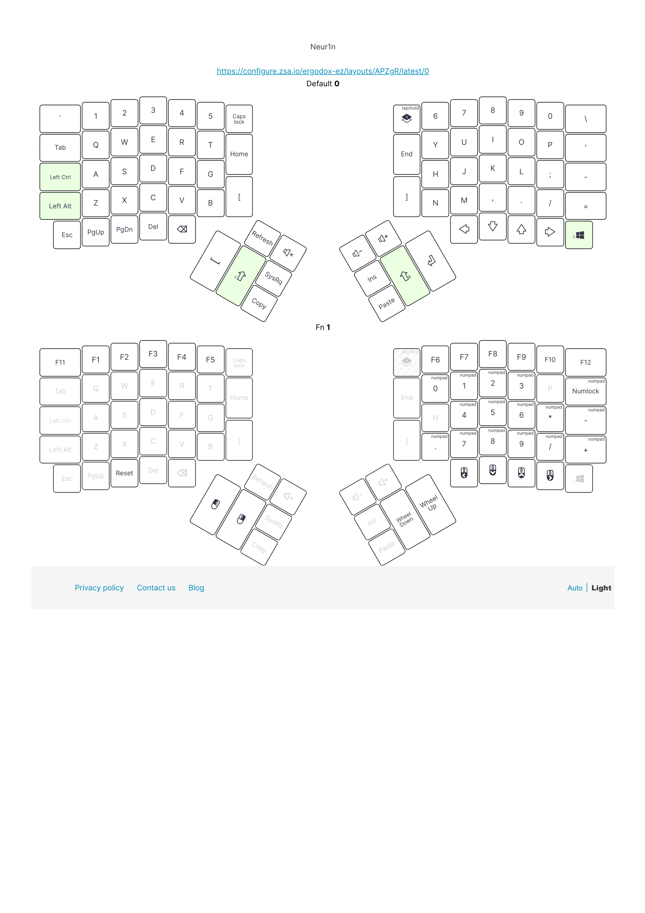
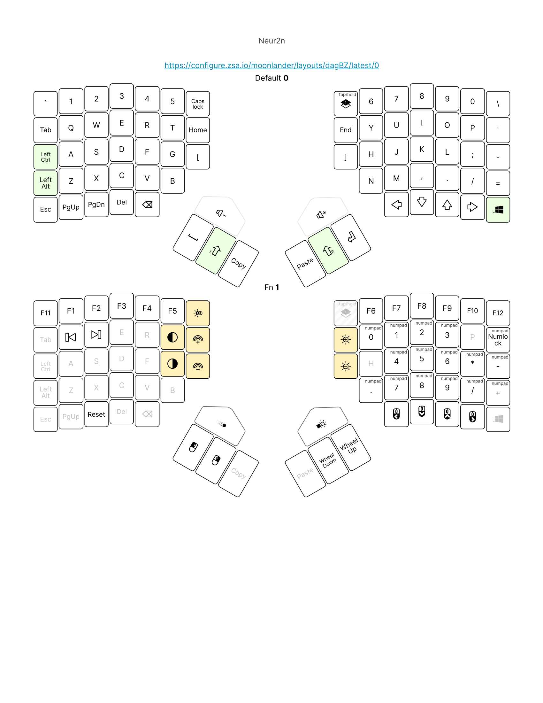

# ergodox-layout

The latest configuration can be accessed [here](https://configure.ergodox-ez.com/ergodox-ez/layouts/APZgR/latest/0) (Ergodox) and [here](https://configure.ergodox-ez.com/moonlander/layouts/dagBZ/latest/1) (Moonlander MK1).

